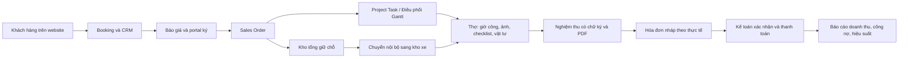

# Báo cáo triển khai ERP bảo dưỡng XYZ

## Mục tiêu
Demo học phần cho Nhóm 5 (2 sinh viên), hướng dẫn bởi Mr. Hiếu. Hệ thống sử dụng Odoo 18 Community để kết nối website, bán hàng, điều phối, vật tư, thực địa, nghiệm thu và kế toán. Mục tiêu là chứng minh luồng nghiệp vụ cùng các điểm kiểm soát bằng dữ liệu giả lập.

## Kiến trúc

Odoo và PostgreSQL chạy trong container riêng; Mailpit nhận toàn bộ email thử nghiệm. Database và filestore dùng volume. Ba addon bổ sung nghiệp vụ, không sửa mã nguồn Odoo. Image được khóa bằng digest, thư viện Gantt 7.7.3 được lưu cục bộ.

## Đối chiếu yêu cầu

| Yêu cầu | Cách triển khai |
|---|---|
| Website/eCommerce | Website Odoo, hai dịch vụ công nghiệp, form đặt lịch responsive |
| CRM và báo giá tự động | Booking sinh opportunity và sale.order; giá tại server, email/PDF, trạng thái báo giá đã gửi |
| Khách chấp nhận | Cổng portal và chữ ký báo giá chuẩn Odoo |
| B2B/B2C | Bảng giá VND, B2B giảm 10%, điều khoản 30 ngày; không nhận diện khách cũ chỉ bằng email nhập vào |
| Kho xe | Vị trí nội bộ, phiếu chuyển từ kho tổng, xuất lượng thực dùng, trả bằng chứng từ |
| Bổ sung vật tư | Min/max và Buy route tạo RFQ; nhân viên duyệt PO |
| HR và điều phối | Hồ sơ thợ, kỹ năng, khu vực, ca; Gantt theo người và thời gian |
| Chống lịch trùng | Kiểm tra tại server và tuần tự hóa giao dịch cùng thợ; kiểm thử hai transaction độc lập |
| Thực địa | Form web Odoo trên điện thoại, bản đồ, timer ra Timesheets |
| Nghiệm thu | Checklist, ảnh, tên người ký, chữ ký, tổng tiền thực tế và PDF lưu riêng |
| Sửa nghiệm thu | Chỉ trước khi post hóa đơn: đảo tiêu hao, hủy hóa đơn nháp, giữ bản ký cũ và yêu cầu ký lại |
| Hóa đơn và thanh toán | Từ dữ liệu thực tế; Demo provider, tiền mặt do kế toán xác nhận |
| Nhắc nợ | Cron mốc 1/7/14 ngày, log chống gửi trùng |
| Phân quyền | Sale theo chủ sở hữu; thợ theo việc; điều phối; kho; kế toán; giám đốc chỉ báo cáo |
| Báo cáo | Pivot/graph/list: doanh thu trừ credit note, giá vốn trừ vật tư trả, giờ công, hoàn thành, đúng hạn, công nợ trong hạn và quá hạn theo khách hàng |
| Ngôn ngữ Anh/Việt | Tiếng Anh là ngôn ngữ nguồn, tiếng Việt là bản dịch trong `i18n/vi_VN.po` (307 thuật ngữ, không còn chuỗi thiếu); đổi bằng nút trên thanh trên cùng và bộ chọn trên website; PDF/email theo ngôn ngữ người nhận |
| Bàn giao | Compose, seed, hướng dẫn, test, ảnh giao diện, backup/restore và kịch bản video |

## Các quyết định nghiệp vụ
- Một đơn ứng với một công việc và một thợ chính. Lịch khách nhập là yêu cầu, không giữ lịch thợ ngay khi gửi form.
- Phí dịch vụ cố định được giữ; giờ công và vật tư tính theo thực tế. Tổng tiền được hiển thị trước nghiệm thu và lưu cùng bản ký.
- Kho xe là tồn kho nội bộ của công ty. Chuyển vật tư lên xe không được tính thành vật tư đã giao khách.
- Nghiệm thu tạo hóa đơn nháp; kế toán chịu trách nhiệm xác nhận. Thợ khai báo tiền mặt, không tự quyết định trạng thái thanh toán.
- Tự động mua hàng dừng ở RFQ để người phụ trách duyệt PO.
- Nhãn, view, báo cáo và website viết bằng tiếng Anh làm ngôn ngữ nguồn, tiếng Việt là bản dịch đầy đủ; không viết thẳng hai thứ tiếng trong mã nguồn để giao diện và bản dịch còn bảo trì được. Từ ngữ nghiệp vụ riêng nằm trong `scripts/i18n_terms.json`, và `scripts/i18n_merge.py` báo rõ chuỗi nào còn thiếu thay vì xuất bản dịch trông có vẻ đã xong.
- Chứng từ nghiệm thu không bị ghi đè. Khi hóa đơn đã post, xử lý bổ sung qua công việc mới và chứng từ hoàn/điều chỉnh chuẩn Odoo.

## Kiểm chứng và giới hạn
Kết quả thực tế được ghi tại `STATUS.md` và `TEST_RESULTS.md`. Kiểm thử code và trình duyệt tự động không thay thế buổi UAT với giảng viên, thợ và kế toán đóng vai. Chưa triển khai thiết bị thật, ngân hàng thật, hóa đơn điện tử có giá trị pháp lý, ứng dụng native/offline hoặc tối ưu tuyến đường. Không tuyên bố tương đương toàn bộ Odoo Enterprise Field Service/Planning.

## Phân công và trình bày
Sinh viên A trình bày hạ tầng, website/CRM/Sales, hóa đơn và báo cáo. Sinh viên B trình bày kho, HR, Gantt, thực địa và nghiệm thu. Cả hai trình bày các kiểm thử âm tính, bản sao lưu và kết quả khôi phục. Dùng `UAT.md` làm kịch bản demo 10–15 phút và điền kết quả buổi nghiệm thu thực tế.
